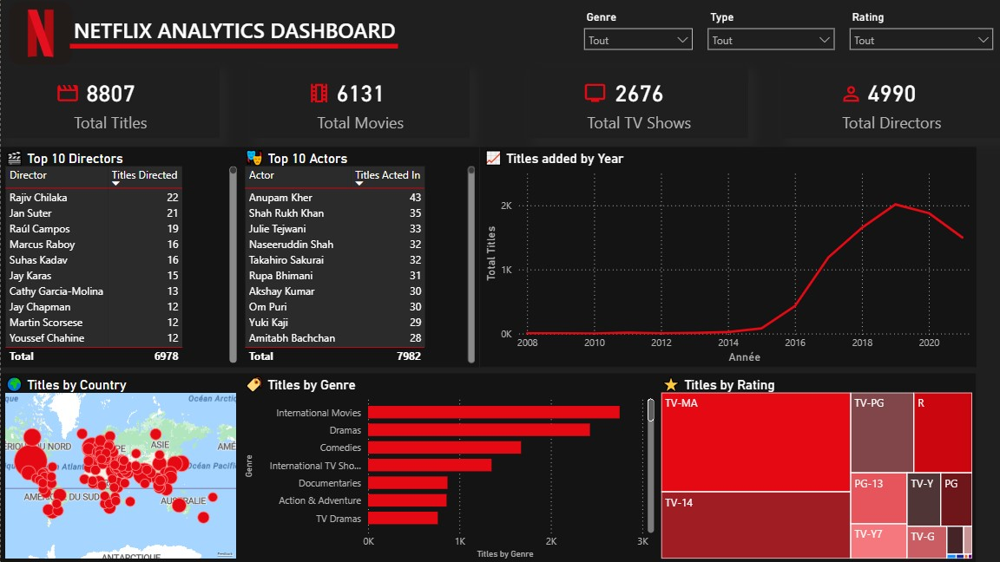
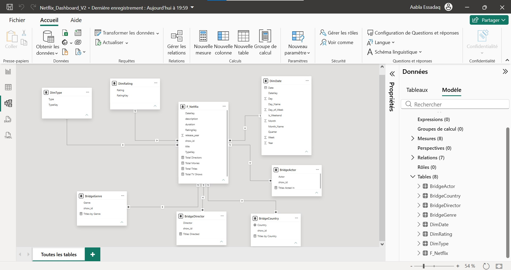
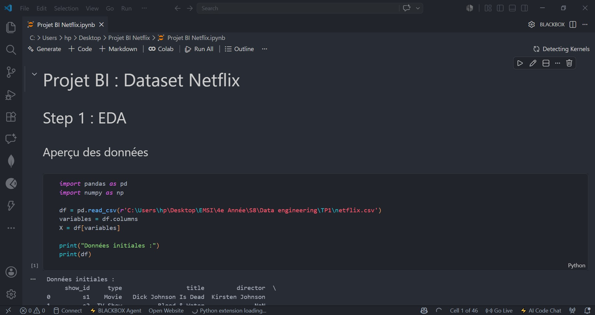
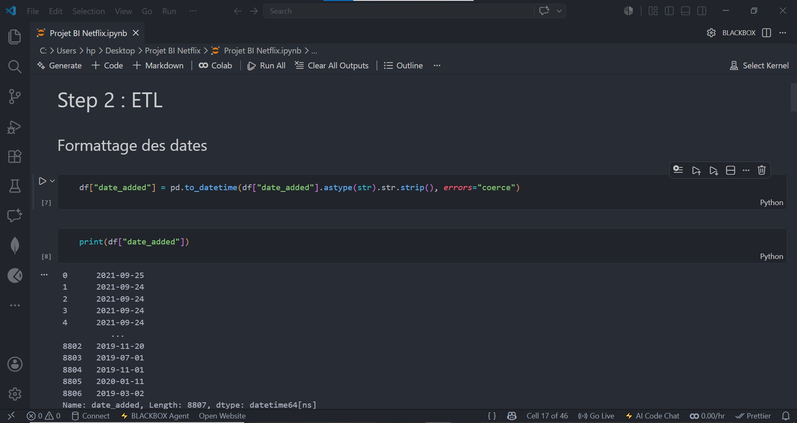

# Projet Data Engineering & Business Intelligence : Dashboard Netflix

Ce projet présente la mise en place d'un pipeline de **Data Engineering** et de **Business Intelligence (BI)** complet à partir du jeu de données brut de Netflix. L'objectif est de nettoyer, modéliser sous forme de schéma en étoile, et visualiser les données dans un dashboard interactif Power BI, tout en garantissant une cohérence stricte des données grâce à un script de validation automatisé.

---

## 📸 Captures d'Écran du Projet

Voici les captures illustrant les différentes étapes de conception de ce projet :

### 1. Dashboard Power BI (Version Finale)
Le dashboard propose une interface premium sur thème sombre facilitant l'exploration des données Netflix (KPIs, tendances de croissance, répartition géographique et catégorielle).


### 2. Modélisation en Étoile (Power BI Model View)
Les dimensions découpées (Acteurs, Pays, Genres, Directeurs) sont connectées à la table de faits `F_Netflix` avec des relations configurées de manière à propager correctement les filtres.


### 3. Notebook de Traitement & ETL (Jupyter Notebook)
Le notebook de prétraitement effectue les étapes d'exploration de données (EDA) et applique les règles de nettoyage et de structuration.



---

## 🛠️ Méthodologie du Projet

Le projet suit une démarche structurée en 5 phases :


### Phase 1 : EDA (Exploratory Data Analysis)
L'exploration initiale effectuée dans le notebook "Projet BI Netflix.ipynb" a révélé plusieurs caractéristiques et anomalies dans les données brutes :
* **Types de données** : Toutes les colonnes (sauf l'année de sortie `release_year`) étaient stockées sous forme de chaînes de caractères (type `object`), y compris les dates.
* **Valeurs manquantes** : Des données nulles étaient présentes sur les colonnes `director` (2 634), `cast` (825), `country` (831), `date_added` (10), `rating` (4) et `duration` (3).
* **Anomalie de décalage** : Les durées de trois spectacles comiques de Louis C.K. (ex. `"74 min"`) étaient enregistrées par erreur dans la colonne `rating`.

---

### Phase 2 : Pipeline ETL (Extract, Transform, Load)
Le pipeline de nettoyage et de structuration a été codé en Python avec la bibliothèque Pandas :

1. **Restauration des valeurs manquantes** : Remplacement des valeurs vides par des valeurs standardisées (`"Unknown"`, `"Not specified"`) pour éviter la perte d'informations.
2. **Correction des anomalies de classification** :
   ```python
   mask = df["rating"].str.contains("min", na=False)
   df.loc[mask, "duration"] = df.loc[mask, "rating"]
   df.loc[mask, "rating"] = "Not specified"
   ```
3. **Nettoyage et formatage temporel** :
   > Pour éviter de perdre 88 dates d'ajout qui contenaient des espaces blancs au début (ex. `" August 4, 2017"`), nous avons nettoyé la colonne avant la conversion :
   ```python
   df["date_added"] = pd.to_datetime(df["date_added"].astype(str).str.strip(), errors="coerce")
   ```
4. **Explosion des attributs multi-valués** : Les colonnes contenant des listes séparées par des virgules (`cast`, `listed_in`, `country`, `director`) ont été divisées et explosées via `.str.split().explode()` afin d'obtenir des tables de dimensions uniques normalisées.
5. **Création d'une dimension temps robuste** : Génération d'une dimension de dates (`DimDate`) calculée du minimum au maximum de `date_added`, contenant les attributs de clé de date (`YYYYMMDD`), trimestre, semaine, jour de la semaine et indicateur de week-end.

---

### Phase 3 : Modélisation des Données (Schéma en Étoile)
Afin de garantir des performances optimales et une clarté analytique dans Power BI, les données ont été organisées sous la forme d'un **Schéma en Étoile (Star Schema)** composé d'une table de faits centrale et de ses dimensions :


* **Table de Faits : `F_Netflix`** : Contient l'identifiant du titre (`show_id`), le titre original, l'année de sortie, la durée, la description ainsi que les clés de substitution : `TypeKey`, `RatingKey` et `DateKey`.
* **Dimensions de Liaison Directe** (1 to Many) : `DimType`, `DimRating`, `DimDate`.
* **Dimensions Multi-valuées Explosées** (Many to Many via clé naturelle `show_id`) : `DimGenre`, `DimCountry`, `DimDirector`, `DimActor`.

> **Configuration requise dans Power BI Desktop :**
> Puisque les dimensions explosées comportent plusieurs enregistrements pour un même show (par exemple, plusieurs genres ou plusieurs pays), vous devez modifier la **Direction du filtre croisé** en **"À double sens" (Both)** pour les relations reliant `F_Netflix` à :
> * `DimGenre`
> * `DimCountry`
> * `DimDirector`
> * `DimActor`
> *Ceci permet aux filtres de se propager correctement depuis les dimensions vers la table de faits.*

---

### Phase 4 : Dashboard & Design UI/UX
L'interface utilisateur a été conçue pour offrir une expérience utilisateur premium, inspirée des codes visuels de Netflix :
* **Palette Chromatique** : Thème sombre (Dark Mode) avec un fond gris foncé/noir, du texte contrasté blanc/gris clair, et l'usage de la couleur **Rouge Netflix** (#E50914) comme couleur d'accent pour attirer l'œil sur les KPIs majeurs.
* **Typographie** : Utilisation de polices modernes et épurées pour une lisibilité maximale des données numériques.
* **Mise en page (Layout)** :
  * **En-tête** : Titre clair accompagné des filtres dynamiques (Année, Type de contenu).
  * **Section KPI (Haut)** : 4 cartes de synthèse majeures (Nombre de titres, Nombre de films, Nombre de séries, Nombre de réalisateurs).
  * **Section Centrale** : Tendance historique des ajouts (Courbe temporelle) et répartition géographique (Carte ou Top Pays).
  * **Section Basse** : Top genres et classification de contenu (Rating).

---

### Phase 5 : Validation & QA (Qualité des Données)
Un script de contrôle d'intégrité et de cohérence métier a été développé en Python : "verify_data_integrity.py".

Ce script permet de s'assurer à tout moment qu'aucune anomalie ne s'est glissée lors de l'ETL :
* **Intégrité Référentielle** : Validation de l'absence de clés étrangères orphelines dans la table de faits et cohérence des liaisons de dimensions.
* **Unicité** : Garantie que `show_id` est bien la clé primaire de la table de faits.
* **Réconciliation de Casse** : Détection des variations de majuscules (ex. *Andrew Lau Wai-keung* vs *Andrew Lau Wai-Keung*) qui expliquent les différences de comptage entre Python et la base Power BI.

#### Pour exécuter la validation :
```bash
python verify_data_integrity.py
```

---
